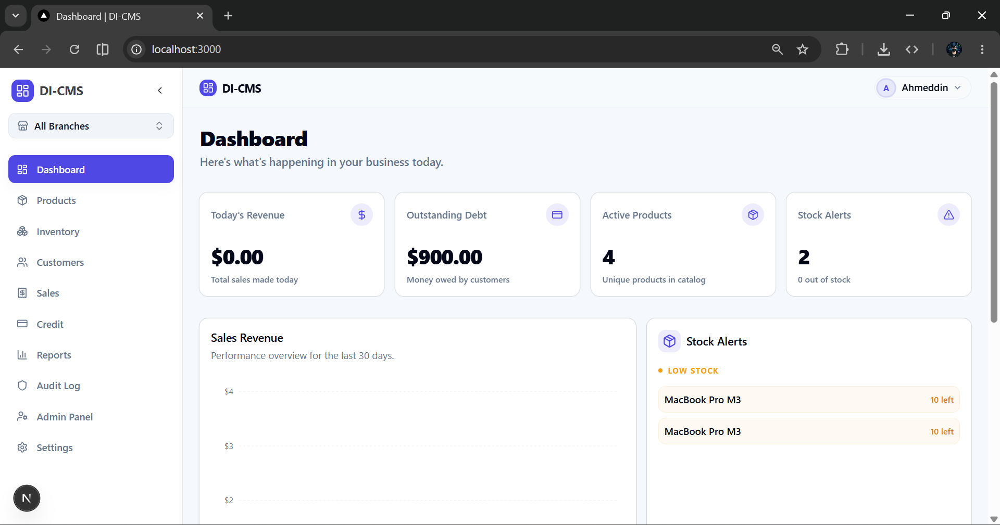
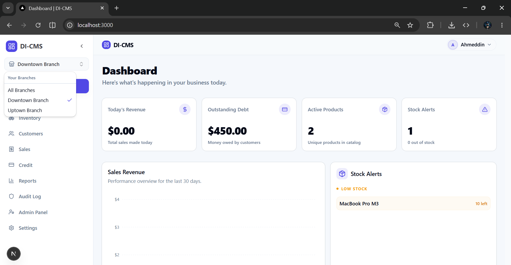
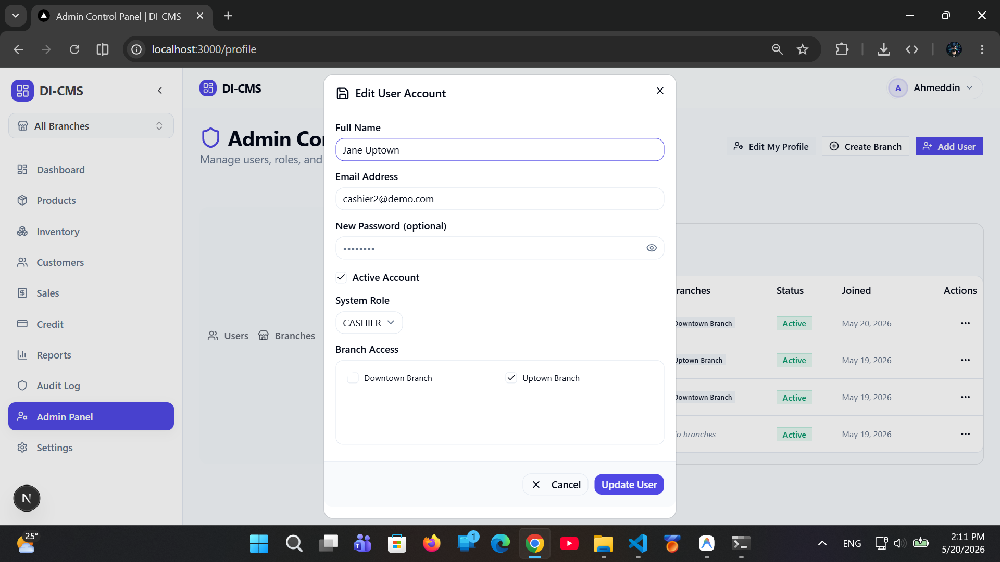
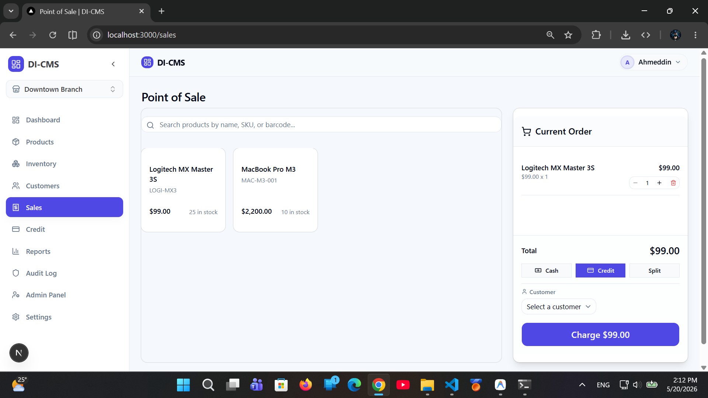

# 📦 Digital Inventory & Credit Management System (DI‑CMS)

[](https://nextjs.org/)
[](https://www.typescriptlang.org/)
[](https://www.prisma.io/)
[](https://www.postgresql.org/)
[](https://opensource.org/licenses/MIT)

---

## 🎯 One‑Line Summary
A production‑grade, multi‑branch SaaS platform for shop owners and staff to manage inventory, sales, customer credit, and daily finances with fine‑grained role‑based access.

---

## 📖 What the System Does
DI‑CMS provides a single web interface that lets a retail organization:
* Track stock across **multiple branches** in real time.
* Run **POS sales** with cash, credit, and split‑payment modes.
* Manage **customer credit limits** and record repayments.
* Generate **financial and inventory reports**.
* Enforce **RBAC** so each employee only sees data they are permitted to.
* Allow a **Super Admin** to edit their own profile (name, email, password) directly from the Admin Control Panel.

---

## ✨ Key Features
| Feature | Description |
|---|---|
| **Multi‑Branch Support** | Organizations can create any number of shops; users are scoped to a branch or have global view. |
| **Role‑Based Access Control** | `SUPER_ADMIN`, `OWNER`, `INVENTORY`, `CASHIER` with branch‑aware permissions. |
| **POS Engine** | Real‑time stock validation, partial payments, and atomic transaction handling. |
| **Customer Credit Management** | Configurable credit limits, automatic debt tracking, repayment workflow. |
| **Audit Log** | Immutable log of every user action for compliance and troubleshooting. |
| **Dynamic Low‑Stock Alerts** | Branch‑specific thresholds with UI badges. |
| **Super Admin Profile Editing** | Super Admins can update name, email, and password without leaving the Admin panel. |

---

## 🛠️ Tech Stack
| Layer | Technology |
|---|---|
| **Frontend** | Next.js 16 (App Router) • React Server Components • Tailwind CSS • Lucide icons |
| **Backend / API** | Next.js Server Actions • NextAuth.js (JWT) • Prisma ORM |
| **Database** | PostgreSQL |
| **Language** | TypeScript (strict) |
| **Styling** | Tailwind CSS (dark / light mode) |
| **Containerisation** | Docker‑compose (optional) |

---

## 🏗️ Architecture Overview
```text
┌─────────────────────┐   ┌───────────────────────┐
│  Next.js Frontend   │   │   Next.js Server‑Side  │
│ (React, RSC, UI)    │◄─►│  Actions & API Routes │
└─────────▲───────────┘   └────────────▲──────────┘
          │                         │
          │   Prisma Client         │
          ▼                         ▼
   ┌───────────────────────┐   ┌─────────────────────┐
   │   PostgreSQL DB       │   │  NextAuth (JWT)      │
   └───────────────────────┘   └─────────────────────┘
```
* **UI Layer** – All pages are built with the App Router, using server‑components where possible for SEO and performance.
* **Server Actions** – Business logic (user upserts, sales, credit, inventory) lives in `src/features/*/actions.ts` and is protected by role‑checking middleware.
* **RBAC** – Enforced at three levels: UI hide‑/show, middleware on page routes, and server‑action guards (`requireSuperAdmin`, `requireBranchAccess`).
* **Multi‑Branch Isolation** – `shopId` is injected into every query via the session context; global users (`SUPER_ADMIN`) can view all shops but write only when a specific branch is selected.

---

## 👥 Roles & Permissions
| Role | Global Scope | Branch Scope | Main Capabilities |
|------|--------------|--------------|-------------------|
| **SUPER_ADMIN** | Full read‑only across all shops; can switch to a branch for write operations. Can edit own profile. | Full CRUD on all resources when a branch is active. | Organization‑wide settings, user management, audit logs. |
| **OWNER** | None (must select a branch). | Full CRUD within assigned shop. | Shop configuration, inventory, sales, credit. |
| **INVENTORY** | None. | CRUD on products & stock only. | Stock adjustments, low‑stock alerts. |
| **CASHIER** | None. | Create sales, view customers & credit, no admin screens. | POS checkout, partial payments, repayment recordings. |

---

## 🌐 Multi‑Branch / Organization Support
* **Organization → Shops** hierarchy stored in `prisma.organization` and `prisma.shop` tables.
* Users are linked to an organization and optionally to a `shopMembership` that defines their role per branch.
* A **branch picker** in the UI stores the current `activeShopId` in the session; all queries filter by this value.
* Global mode (`All Branches`) is read‑only for write operations – safeguarding data integrity.

---

## 📂 Main Modules & Workflows
| Module | Core Files | Primary Responsibilities |
|--------|------------|--------------------------|
| **auth** | `src/lib/auth.ts`, `src/app/api/auth/[...nextauth]/route.ts` | Session handling, JWT, role middleware. |
| **users** | `schemas.ts`, `actions.ts`, `components/user-dialog.tsx` | User CRUD, profile editing, Super Admin UI hiding. |
| **shops** | `features/shops/*` | Shop creation, branch settings, low‑stock thresholds. |
| **inventory** | `features/inventory/*` | Product catalog, stock adjustments, audits. |
| **sales** | `features/sales/*` | POS cart, checkout, payment modes, atomic stock decrement. |
| **customers** | `features/customers/*` | Credit limits, debt tracking, repayment forms. |
| **reports** | `features/reports/*` | KPI dashboards, financial statements per branch. |
| **audit** | `features/audit/*` | Immutable logging of user actions. |

---

## ⚙️ Setup & Installation
```bash
# 1️⃣ Clone the repo
git clone https://github.com/Ahmeddin/di-cms.git
cd di-cms

# 2️⃣ Install dependencies
npm ci   # deterministic install

# 3️⃣ Create .env (copy from .env.example if present)
cp .env.example .env
# Edit .env with your DB credentials and NextAuth secret.

# 4️⃣ Initialise the database
npx prisma generate        # generate client types
npx prisma db push        # apply schema
npx prisma db seed        # optional seed data (roles, demo shops)

# 5️⃣ Run the dev server
npm run dev                # http://localhost:3000
```
> **Tip:** The project works out‑of‑the‑box with Docker‑Compose (`docker-compose.yml`) which starts PostgreSQL and runs the migrations.

---

## 🌱 Environment Variables
| Variable | Description |
|---|---|
| `DATABASE_URL` | PostgreSQL connection string (required). |
| `NEXTAUTH_URL` | Base URL for NextAuth callbacks (e.g., `http://localhost:3000`). |
| `NEXTAUTH_SECRET` | 32‑byte secret for signing JWTs. |
| `NEXT_PUBLIC_APP_NAME` *(optional)* | Friendly name displayed in the UI header. |
| `SMTP_HOST`, `SMTP_PORT`, `SMTP_USER`, `SMTP_PASS` *(optional)* | If email notifications are added later. |

---

## 🗄️ Database & Prisma
* **Schema** – located in `prisma/schema.prisma`. Core models: `User`, `Organization`, `Shop`, `Product`, `ShopMember`, `Sale`, `Customer`, `CreditPayment`, `AuditLog`.
* **Generated Types** – `node_modules/.prisma/client` provides fully typed CRUD via `prisma.<model>`.
* **Migrations** – Managed by Prisma Migrate (`npx prisma migrate dev`).
* **Seeding** – `prisma/seed.ts` creates default roles (`SUPER_ADMIN`, `OWNER`, `INVENTORY`, `CASHIER`) and a demo organization.

---

## 📦 Available Scripts
| Script | Description |
|---|---|
| `npm run dev` | Starts the Next.js development server. |
| `npm run build` | Generates an optimized production build. |
| `npm start` | Runs the production build (`next start`). |
| `npm test` | Executes the Jest/React Testing Library suite (if present). |
| `npm run lint` | Runs ESLint with the project’s config. |
| `npm run db:migrate` | Runs Prisma migrations in development. |
| `npm run db:deploy` | Deploys production migrations. |
| `npm run db:studio` | Opens Prisma Studio for DB inspection. |
| `docker-compose up -d` | Starts PostgreSQL container and applies migrations (requires Docker). |

---

## 🚀 Deployment Notes
* The app is deployed live at **https://dicms.vercel.app** (Vercel). It can also be deployed to Netlify or any Node‑compatible host.
* Ensure the environment variables above are set in the hosting platform.
* When deploying, run `npx prisma generate && npx prisma db push` as part of the build step.
* For **Docker** production, use the provided `Dockerfile` (not shown) and the `docker-compose.yml` as a reference.

---

## 📂 Folder Structure (Important Directories)
```
src/
├─ app/                 # Next.js App Router pages & layout
├─ components/          # UI library (buttons, dialogs, tables)
├─ features/            # Domain‑driven modules (users, sales, inventory…)
│   ├─ users/           # RBAC, profile dialogs, upsert action
│   ├─ shops/           # Branch configuration
│   ├─ inventory/       # Product CRUD
│   ├─ sales/           # POS cart & checkout
│   ├─ customers/       # Credit limits & repayments
│   └─ …                # Other business domains
├─ lib/                 # Prisma client, NextAuth, helpers
├─ generated/           # Prisma client typings (auto‑generated)
├─ types/               # Global TypeScript types
└─ prisma/              # Prisma schema & seed scripts
```

---

## 📸 Screenshots 

| Screen | Description |
|---|---|
|  | Organization overview with KPI widgets. |
|  | Switch between branches instantly. |
|  | Profile edit with hidden role/branch fields. |
|  | Cash, credit & split‑payment flows. |

---

## 🔮 Future Improvements
* **Invoice PDF generation** with email delivery.
* **CSV/Excel export** for sales and inventory reports.
* **Custom role builder** so owners can define granular permissions.
* **WebSocket real‑time updates** for stock levels across branches.
* **Advanced analytics** – revenue heat‑maps, churn predictions.

---

## 📄 License & Contact
**License:** MIT – see `LICENSE` file.

**Author:** Ahmed Hussen – [GitHub](https://github.com/Ahmeddin) • [Portfolio](https://ahmedhussen.netlify.app/)

If you find this project useful, please ⭐ the repository!
